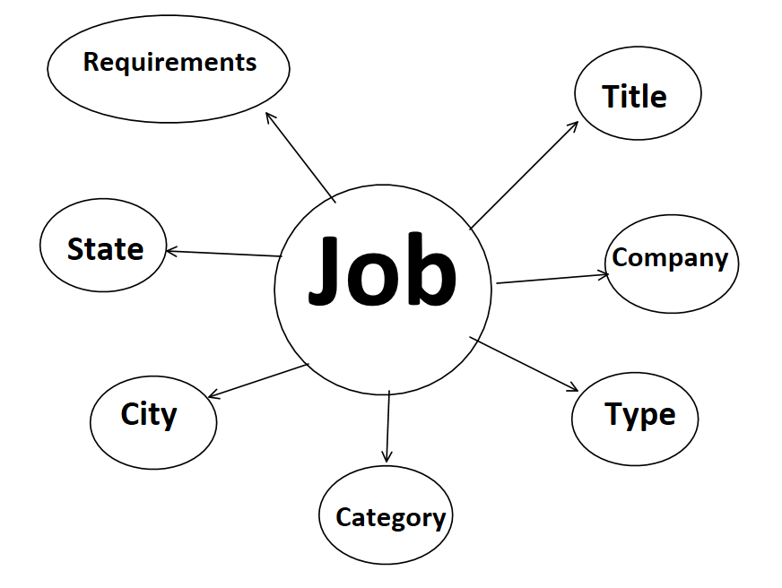
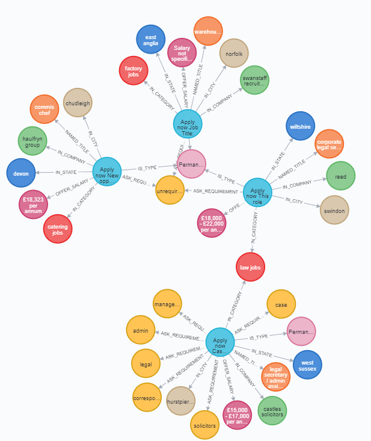

# Progress Log 
*Eduardo Alán Hernández Villasana*
***************
* **May 19, 11:00**: I open the reed uk file for the first time and read the context and description od the data. Before to choose wich exersice to do (graph database or train a machine learning algorithm) i will investigate more about graph databases and prepare the data.
* **May 19, 12:00**: Data Exploration, most of the work will be managing strings
* **May 19, 15:00**: Investigating about graph databases with neo4j.
* **May 20, 10:00**: Investigating how to create a graph database from a csv file using python. [Tutorial that I based on.](https://towardsdatascience.com/create-a-graph-database-in-neo4j-using-python-4172d40f89c4)

* **May 20, 11:00**: After I investigated about graph databases in Neo4j, I desided to make the graph databases exersice.

* **May 20, 12:00**: Data cleaning. I have to do a deep cleaning on the `job_requirements` column to have a list of single requirements not a long string.

* **May 20, 19:00**: Looking at the data, I have created a model of how the data will be conected in the graph database. Here is the model:




* **May 20, 20:00**: I had a problem, the requirements colum was a string and i needed to devide this string in a list of sigle requirements. To do this i used some language processing methods to separate the string into single words. I also had to replace some repetitive frace and fill NaN rows.

* **May 20, 21:00**: Preparing the dataframe for the graph database. Following the model that i had created, i separated the **`category`, `city`, `company`, `requirements`, `title`, `type`, `state`** and **`salary`** columns into single dataframes. I also made a *job* dataframe with **`id`, `description`** and **`post_date`**.

* **May 20, 23:00**: I created a Neo4j account and started a blank sand box, this sand box database will last until May 30th. I also made the connection and data insert functions. Next i use queries to create the nodes. For this i had to investigate how Neo4j works.

* **May 21, 1:00**: After i run some test and tried to load the data to the database i decided to try again in the morning, there must be some bug i dont see that not allow data be loaded to the database.

*error code:* ``` Query failed: {code: Neo.ClientError.Transaction.TransactionTimedOut} {message: The transaction has been terminated. Retry your operation in a new transaction, and you should see a successful result. The transaction has not completed within the specified timeout (dbms.transaction.timeout). You may want to retry with a longer timeout. } ```

* **May 21, 12:00**: The bug was in some node names in the *add_data* functions, i also had to modify the bach size of the `insert_data` function with some nodes because the data to be loadad was large. The next image is how the nodes and relationships can bee seen in Node4j.


* **May 21, 17:00**: After i had loaded the data into the database, i started investigating how to make complex queries to get somo info, but now i see it will need more time to learn how to make them, so, i made some simples ones and i will use them.

* **May 22, 0:00**: I made some plots using the data i got from simple queries, there are 5 bar plots and one line plot. I will just make some adjustments before i send the notebook and this log file.

